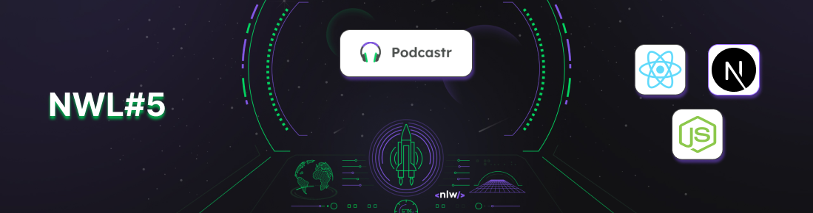

## NLW#5 - Trilha ReactJs - Podcastr

Projeto criado com a intenção de conhecer a tecnologia [Next.js](https://nextjs.org/) durante o Next Level Week 5

## 🛠 Tecnologias Utilizadas

- [JavaScript](https://developer.mozilla.org/pt-BR/docs/Web/JavaScript)
- [React](https://pt-br.reactjs.org/)
- [Next.js](https://nextjs.org/)
- [Saas](https://sass-lang.com/)
- [date-fns](https://date-fns.org/)
- [json-server](https://github.com/typicode/json-server)

## Conceitos aprendidos

### Teoria:
- Fluxo de uma API
- Conceitos de React
  - Componente
  - Estado
  - Propriedades
- Modelos de Web
  - Web Tradicional
  - SPA -> Single Page Application
  - SSR -> Server Side Rendering
  - SSG -> Static Site Generator

- Diferenças entre React puro e React + Next
  - Vantagens do Next
  - Quando utilizar
  - Demonstração dos resultados depois do deploy

### Prática: 
- Criação do Projeto e primeiras configurações
- Estilização geral do App
- Criação dos componentes
- Configuração da API com json-server
- Consumindo a API e gerando as páginas com Next

